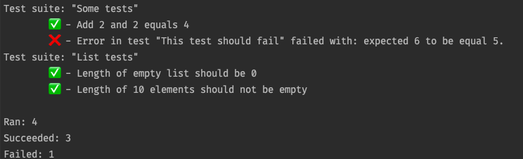

## Fet - F# Easy test

[](https://github.com/Bjorn-Strom/fet/blob/master/LICENSE.md) 

Sometimes you dont need a fully fledged testing suite.
Sometimes you just want to do some assertions without having to import and use a big framework that might just get in your way.

This is where `Fet` shines. It gets out of your way and lets you write tests fast.
It works with both dotnet and fable so you don't need to import huge libraries like Mocha or Jest if you don't need them.

If any tests fail the runner will throw  an exception with the number of tests failed.

### Examples
Define your tests with the `test` function.
You put one more more of these in a `testList`.
To actually run the test add them in a list and send it as an argument to `runTests`.


```fsharp
let tests =
    let add a b = a + b

    testList "Some tests" [
        test "Add 2 and 2 equals 4" <| fun () ->
              let expected = 4
              Expect.equal (add 2 2) expected

        test "This test should fail" <| fun () ->
            Expect.equal (3+3) 5
     ]

let evenMoreTests =
       testList "List tests" [
        test "Length of empty list should be 0" <| fun () ->
            Expect.equal (List.length []) 0

        test "Length of 10 elements should not be empty" <| fun () ->
            Expect.equal (List.isEmpty [1..10]) false
        ]

runTests [ tests; evenMoreTests ]
```
Result:



See more examples in the example folder.
